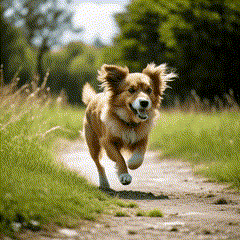

**IN WORKING**

 

## Доклад на конференции DataStart [https://youtu.be/K_zmw-swod8](https://youtu.be/K_zmw-swod8)

 

### Концепция составного обучения модели Splitter для предсказанию нового состояния на примере задачи перевода Text_2_Image в Text_2_Video
#### текущая стадия проекта основана на предыдужей работе [Rotation_train_Text2Image_2_task_Tex2Video](https://github.com/Mike030668/Rotation_train_Text2Image_2_task_Tex2Video)

